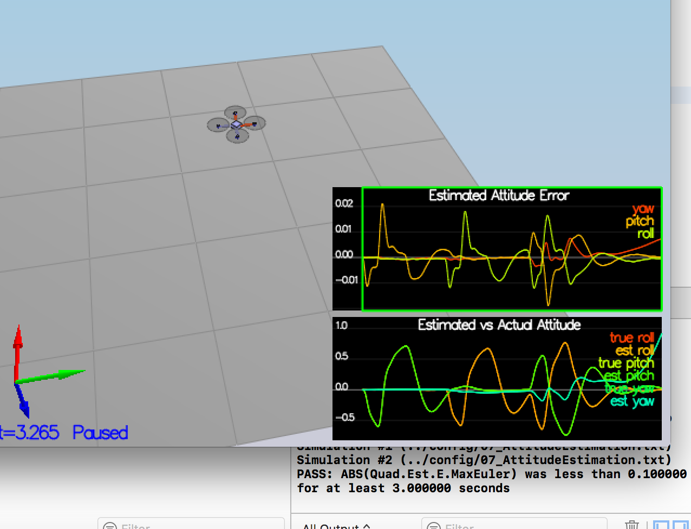
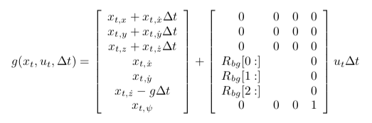
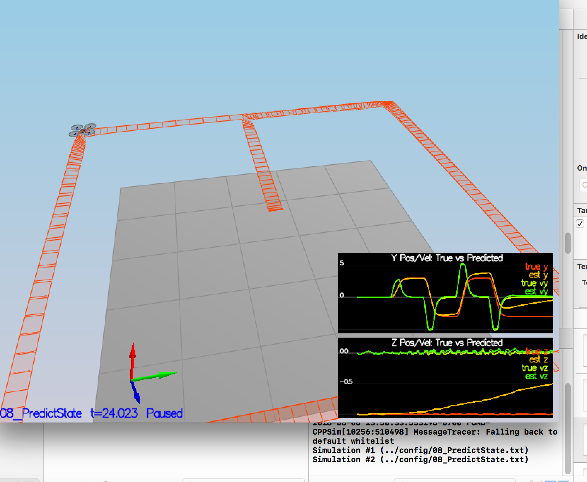
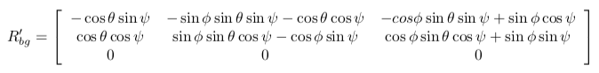
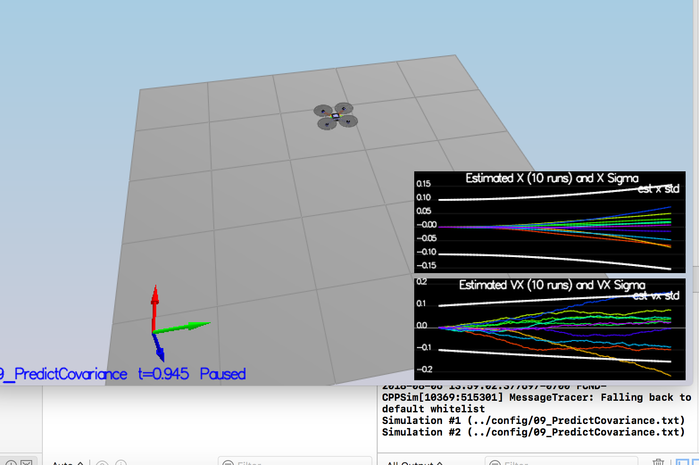
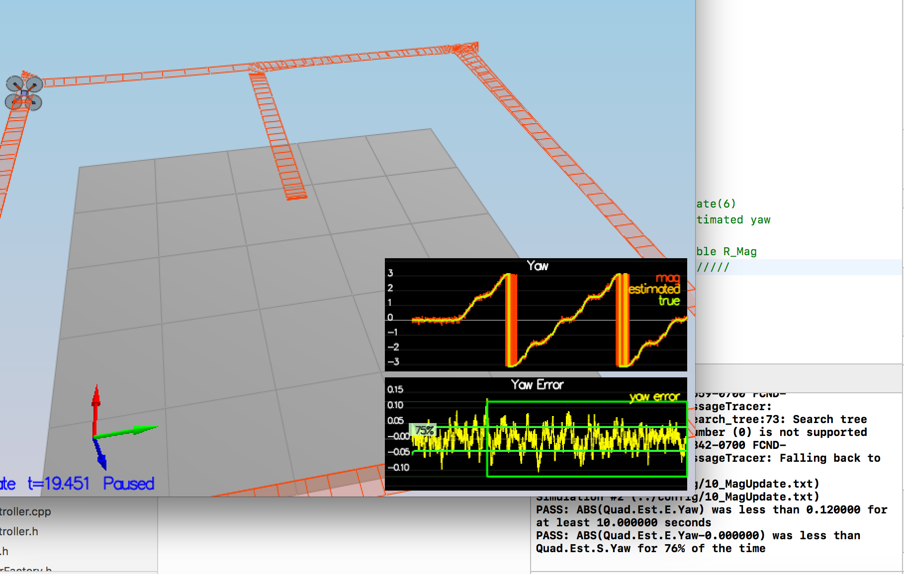
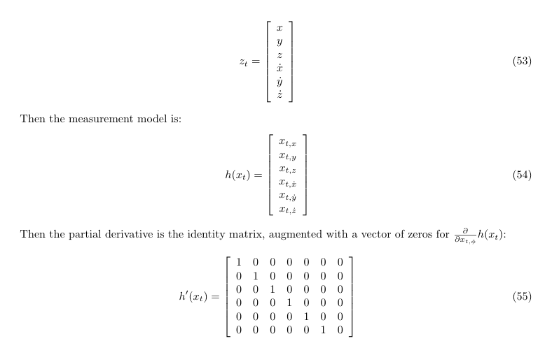
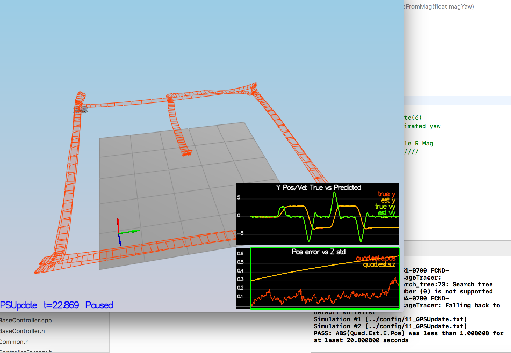

### Step 1: Sensor Noise ###
1. I have set 0.711 and 0.512 as standard deviation for the the GPS X signal and the IMU Accelerometer X signal based on measuring standard deviation of Graph1 and Graph2.txt.
2. Added them to 6_Sensornoise.txt

I was able to pass the test 
" Simulation #2 (../config/06_SensorNoise.txt)
PASS: ABS(Quad.GPS.X-Quad.Pos.X) was less than MeasuredStdDev_GPSPosXY for 68% of the time
PASS: ABS(Quad.IMU.AX-0.000000) was less than MeasuredStdDev_AccelXY for 70% of the time"

### Step 2: Attitude Estimation ###
1. I have updated function UpdateFromIMU() in QuadEstimatorEKF.cpp by using Quaternion<float> class
2. Normalize yaw

### Step 3: Prediction Step ###
1. State Prediction
I applied below equation to update PredictState function.

I rotated accel from bod to intertial by using function attitude.Rotate_BtoI(accel) and dervied the rotation matrix. 
Though estimators now track actual state, still drift exists.

2. Covariance Prediction
1) Complete GetRbgPrime() function based on 

2) Then implement Predict() with GetRbgPrime and PredictState from above following 

3) Tune the QPosXYStd and the QVelXYStd process parameters in QuadEstimatorEKF.txt so that graphs would match with project readme.

### Step 4: Magnetometer Update ###
We are interested in leveraging Magnetometer to estimate yaw. 

1. Tune QYawStd
2. In UpdateFromMag(), I took difference between your measured magYaw and estimated yaw from state vector and passed the args to Update() with R_Mag.

### Step 5: Closed Loop + GPS Update ###
1. Set Quad.UseIdealEstimator to 0 in config/11_GPSUpdate.txt
2. Tune the process noise model in QuadEstimatorEKF.txt
3. Implement the EKF GPS Update in the function UpdateFromGPS() following below process.

Simulation #3 (../config/11_GPSUpdate.txt)
PASS: ABS(Quad.Est.E.Pos) was less than 1.000000 for at least 20.000000 seconds

### Step 6: Adding Your Controller ###
I have added QuadController.cpp and QuadControlParams.txt from previous project and was able to pass 11_GPSUpdate test.

